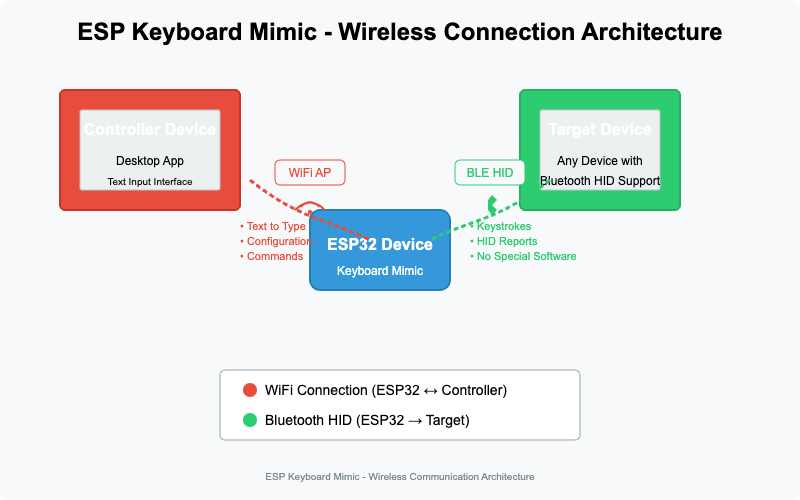

# ESP Keyboard Mimic - Wireless-Only Design

## Overview

ESP Keyboard Mimic operates as a fully wireless solution without USB connectivity. This design choice offers several advantages:

- **True mobility**: No physical cables required for operation
- **Greater compatibility**: Works with devices lacking USB ports or with restricted USB access
- **Simplified deployment**: No drivers or USB permissions needed
- **Enhanced security**: No physical data connection that could be compromised

## Connectivity Architecture

### Dual Wireless Connectivity

The system operates with two separate wireless connections:

1. **Bluetooth HID Connection** (ESP32 → Target Device)
   - ESP32 connects to target device as a standard Bluetooth keyboard
   - No special software required on the target device
   - Supports all platforms recognizing Bluetooth HID keyboards

2. **WiFi Connection** (ESP32 ↔ Controller Device)
   - ESP32 creates a secure WiFi access point
   - Desktop controller application connects to this network
   - Text content transferred over this secure connection
   - Configuration changes sent via this channel

### WiFi Security & Password Management

The WiFi access point created by the ESP32 requires simple but effective security:

1. **Default Password Approach**
   - Single standard default password across all devices
   - Easy to remember and document in user manual
   - Balances security with ease of use
   - Avoids complexity of per-device unique passwords

2. **Password Change Option**
   - Users can change default password through desktop application
   - New password stored in ESP32's non-volatile memory
   - Factory reset option to revert to default password

3. **Connection Security**
   - WPA2 encryption for WiFi connection
   - Limited to single client connection
   - Automatic timeout for inactive sessions

This approach prioritizes usability while maintaining reasonable security, recognizing that the device is physically accessible to users and operates within close physical proximity to both the controller and target devices.

## Power Management

Without USB power, special attention is given to power management:

### Power Supply Options

1. **Battery Operation**
   - LiPo battery with charging circuit
   - Power management IC for efficient operation
   - Low power modes during inactivity
   - Battery level indication in desktop application

2. **External DC Power**
   - DC barrel jack for wall adapter
   - Voltage regulation circuit
   - Power filtering and protection

### Power Optimization Techniques

- BLE power modes for extended battery life
- WiFi power saving modes when not actively transmitting
- Sleep modes during inactivity periods
- Efficient wake-up mechanism using hardware interrupts

## Charging Infrastructure

For battery-powered operation, charging options include:

1. **Micro-USB/USB-C Charging Port**
   - Note: This port is used ONLY for charging, not for data connectivity
   - Standard charging ICs with protection circuits

2. **Wireless Charging Option**
   - Qi-compatible charging option (future enhancement)
   - Eliminates need for any physical ports
